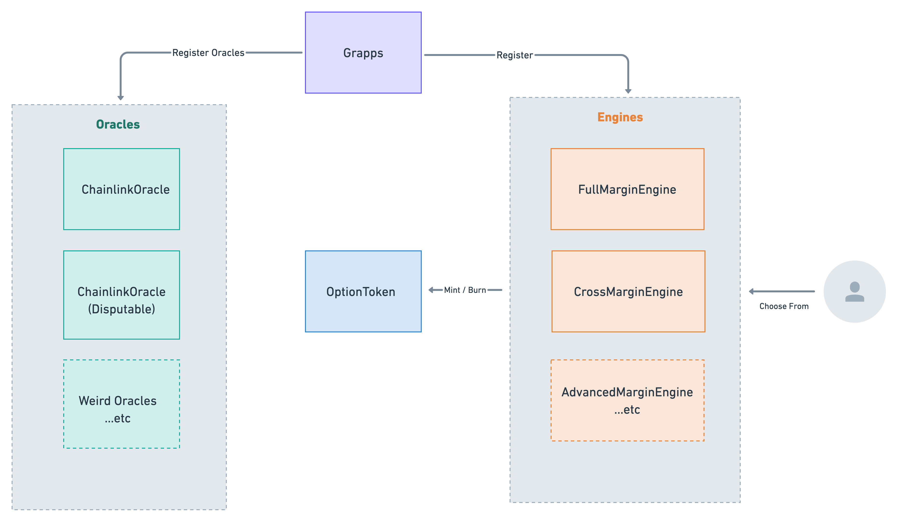

# Contract Architecture

## System Diagram

This is the basic diagram of how all contracts interact with each other.

There are 2 main contracts: `Grappa`, `OptionToken`, and 2 sets of contracts: oracles, and margin engines. 

## `Grappa.sol`

`Grappa.sol` serves as the registry of the system that has an owner role to add assets, oracles and engine into the system.

Grappa is upgradeable right now, given that we might want to expand the definition of "Option Tokens" in the short term to support other derivatives. We will remove the upgradeability once we have enough confidence in the form of the contract.

Grappa is also in charge of settling the options after expiry. Once a optionToken is created by the engine, `Grappa` serve as the fair clearing house to determine the settlement price. Each engines has to comply with the interface to pay out to users accordingly.

## `OptionToken.sol`

`OptionToken`: ERC1155 token that represent the right to claim for a non-negative payout at expiry. It can represent a long call position, a long put position, or debit spreads. How the Id of an option token is interpreted is determined by the Grappa contract at settlement.

## Oracles

Grappa Owner can register bunch of oracles to the system. Oracles are contracts that can be used to determine settlement price, different user / protocol might want to settle with different oracles.

## Margin Engines

**Margine Engines** are contracts that determine the rule to collateralize option tokens. Tokens minted by different engines are not fungible, so that the risk are always isolated. There should be multiple margin engines working together to provide user flexibilities to choose from, based on user preference such as gas fee, capital efficiency, composability and risk.

### List of Margin Engines

- `FullMargin`: Simple implementation of fully collateralized margin. Only accept 1 collateral + 1 short per account. Can be used to mint the following shorts:
  - covered call (collateralized with underlying)
  - put (collateralized with strike)
  - call spread (collateralized with strike or underlying)
  - put spread (collateralized with strike)

- `CrossMargin`: use a single subAccount to hold multiple collateral, long and short positions.
  - Upgradable and maintained by HashNote team
  - Can use single account to collateralize arbitrary amount of short positions, and offset requirements with long positions.
  - Currently fully collateralize all positions. Can be expanded to partial collateral in the future
  - Does not support spread token

- `AdvancedMargin`: mint partially collateralized options which is 3x - 20x more capital efficient compared to fully collateralized options. Requires dependencies on vol oracle to estimate the value of option. Each subAccounts can process:
  - single collateral type
  - can mint 1 call (or call spread) + 1 put (or put spread) in a single account.
  - Some known issues are still WIP. (See Github Issues)
