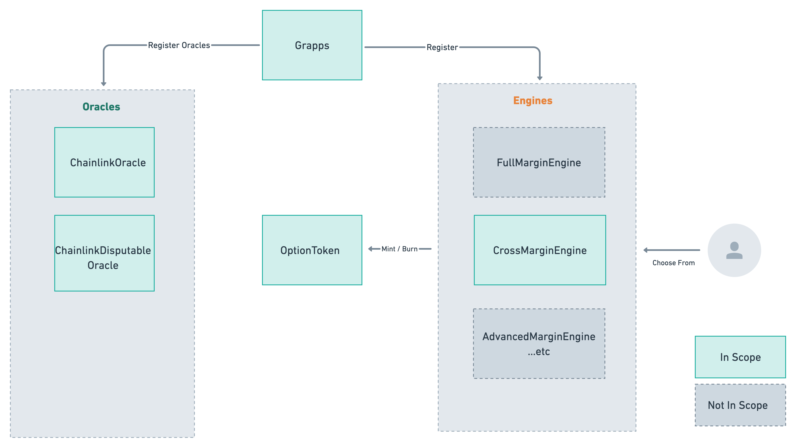

# Audit Guide

This is the guide for first audit in Nov, 2022.

## Scope

During this audit, the 2 main contracts `Grappa` and `OptionToken` are in scope, and only 1 margin engine called `CrossEngine`, and 2 oracles `ChainlinkOracle` and `ChainlinkDisputableOracle` (inherits Chainlink Oracle)

